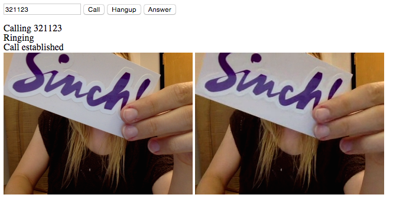

#Building a WebRTC Video Chat Application

This tutorial will help you set up a barebones browser-browser video calling app. You can find the finished source code for this app on [our Github](https://github.com/sinch/js-video-calling)

##FAQs
- Video calling is currently supported in Chrome and Firefox
- Video calling does not work on mobile browsers (they don't have WebRTC)
- To properly run the app in Chrome, you need to start the browser with the flag `--allow-file-access-from-files` ([learn more here](https://www.sinch.com/tutorials/how-to-start-chrome-with-flags/))
- This tutorial uses Sinch user management. This is only for prototyping. When you're ready for production, you need to use delegated security to authenticate users, which you can do with our [Rails + Devise tutorial](https://www.sinch.com/tutorials/authenticating-sinch-rails-devise/) and [C# tutorial](https://www.sinch.com/tutorials/using-delegated-security-application-server-using-c-sinch-sdk/).

##Setup
1. Sign up for a Sinch developer account at [sinch.com/signup](https://www.sinch.com/signup)
2. In the developer dashboard, create a new app. You will need the app key in a few minutes [sinch.com/dashboard](https://www.sinch.com/dashboard/#/apps)
3. Download the Sinch Javascript SDK from [sinch.com/downloads](https://www.sinch.com/downloads)
4. Make a folder on your computer to store the files for this project
5. Create the files **index.html** and **index.js**
6. From the Sinch Javascript SDK, move **sinch.min.js** into your project folder

##View
I've made the html as simple as possible for the sake of keeping the tutorial short. I suggest making this prettier after you have the video calling working. Comments are inline below:

    <head>
        
        
        
    </head>
    
    <body>
        <!-- This form is the only thing that is displayed by default -->
        <form id="authForm">
            <input type="text" id="username" placeholder="username">
            <input type="password" id="password" placeholder="password">
            <input type="submit" value="Login" id="login">
            <input type="submit" value="Sign Up" id="signup">
        </form>
    
        <!-- Hidden until the Sinch client is started successfully -->
        

            <form id="callForm">
                <input type="text" id="usernameToCall" placeholder="username to call">
                <input type="submit" value="Call" id="call">
                <input type="submit" value="Hangup" id="hangup">
                <input type="submit" value="Answer" id="answer">
            </form>
    
            <!-- Will show updates on the current call -->
            

    
            <!-- Will show video streams once call is connected -->
            <video id="outgoing" autoplay></video>
            <video id="incoming" autoplay></video>
        

    </body>
    
##Define Sinch Client
    
First, be sure to enclose all of your javascript in:

    $("document").ready(function() {
        //all js code here!
    });

Define the sinch client with your application key, and calling and video capabilities. 

    sinchClient = new SinchClient({
        applicationKey: "YOUR_APP_KEY",
        capabilities: {calling: true, video: true},
        supportActiveConnection: true,
        onLogMessage: function(message) {
            console.log(message.message);
        },
    });
    
Then, create variables to store the Sinch call client and the current call.
    
    var callClient;
    var call;  
    
##Signup and Login

You can start the Sinch client (for testing purposes only) with a username and password. 

    $("#login").on("click", function (event) {
        event.preventDefault();
        
        var signUpObj = {};
        signUpObj.username = $("input#username").val();
        signUpObj.password = $("input#password").val();

        sinchClient.start(signUpObj, afterStartSinchClient());          
    });
    
To sign up a new user, register them with Sinch, and then start the client with the returned ticket.

    $("#signup").on("click", function (event) {
        event.preventDefault();
        
        var signUpObj = {};
        signUpObj.username = $("input#username").val();
        signUpObj.password = $("input#password").val();

        sinchClient.newUser(signUpObj, function(ticket) {
            sinchClient.start(ticket, afterStartSinchClient());
        });
    });
    
Now, define the method `afterStartSinchClient()`, which is anything you want to happen once the Sinch client has been started. See comments inline:

    function afterStartSinchClient() {
        // hide auth form
        $("form#authForm").css("display", "none");
        // show logged-in view
        $("div#sinch").css("display", "inline");
        // start listening for incoming calls
        sinchClient.startActiveConnection();
        // define call client (to handle incoming/outgoing calls)
        callClient = sinchClient.getCallClient();
        //initialize media streams, asks for microphone & video permission
        callClient.initStream();
        //what to do when there is an incoming call
        callClient.addEventListener(incomingCallListener);
    }
    
##Incoming Call and Current Call Listeners

To listen for incoming calls:

    var incomingCallListener = {
        onIncomingCall: function(incomingCall) {
            $("div#status").append("
Incoming Call
");
            call = incomingCall;
            call.addEventListener(callListeners);
        }
    }
    
Current call listeners:
    
    var callListeners = {
        //call is "ringing"
        onCallProgressing: function(call) {
            $("div#status").append("
Ringing
");
        },
        //they picked up the call!
        onCallEstablished: function(call) {
            $("div#status").append("
Call established
");
            $("video#outgoing").attr("src", call.outgoingStreamURL);
            $("video#incoming").attr("src", call.incomingStreamURL);
        },
        //ended by either party
        onCallEnded: function(call) {
            $("div#status").append("
Call ended
");
            $("video#outgoing").attr("src", "");
            $("video#incoming").attr("src", "");
            call = null;
        }
    }  
    
##Call, Answer, Hangup

The final piece - letting users start and stop calls!

    $("#call").on("click", function (event) {
        event.preventDefault();
        if (!call) {
            usernameToCall = $("input#usernameToCall").val()
            $("div#status").append("
Calling " + usernameToCall + "
");
            call = callClient.callUser(usernameToCall);
            call.addEventListener(callListeners);
    	    }   
    });

    $("#answer").click(function(event) {
        event.preventDefault();
        if (call) {
            $("div#status").append("
You answered the call
");
        	   call.answer();
        }
    });

    $("#hangup").click(function(event) {
        event.preventDefault();
        if (call) {
            $("div#status").append("
You hung up the call
");
            call.hangup();
            call = null
        }
    });
    
You're all done! To test your app - open **index.html** in two separate browser tabs, sign up as two different users, and try calling each other. Please keep in mind that this is just a demo app, and error handling/general user experience is not ready for a production app. If you're running in Chrome, don't forget to start your browser with the `--allow-file-access-from-files` flag. 

    
    
